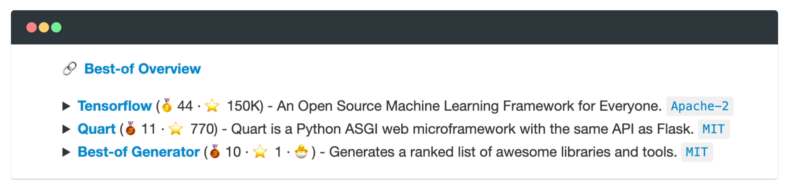
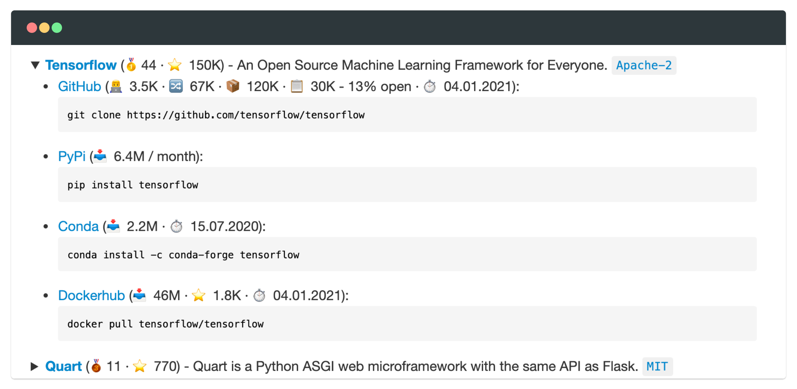
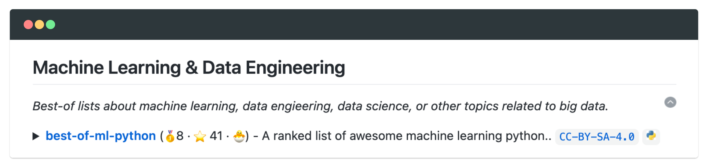
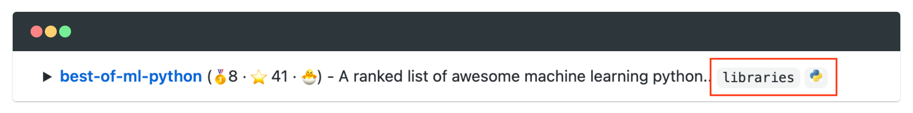
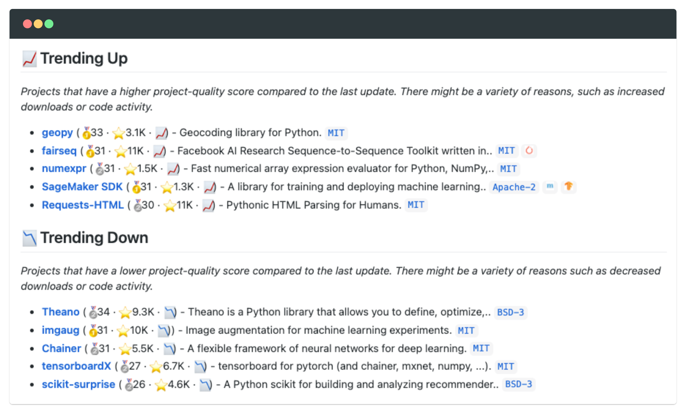

<!-- markdownlint-disable MD033 MD041 -->
<h1 align="center">
    Best-of Generator
</h1>

<p align="center">
    <strong>🏆&nbsp; Generates a ranked markdown list of awesome libraries and tools.</strong>
</p>

<p align="center">
    <a href="https://best-of.org" title="Best-of Badge"></a>
    <a href="https://pypi.org/project/best-of/" title="PyPi Version"></a>
    <a href="https://github.com/best-of-lists/best-of-generator/actions?query=workflow%3Abuild-pipeline" title="Build status"></a>
    <a href="https://gitter.im/ml-tooling/best-of" title="Chat on Gitter"></a>
    <a href="https://bestoflists.substack.com/subscribe" title="Subscribe for updates"></a>
    <a href="https://twitter.com/best_of_lists" title="Best-of on Twitter"></a>
</p>

<p align="center">
  <a href="#getting-started">Getting Started</a> •
  <a href="#documentation">Documentation</a> •
  <a href="#support--feedback">Support</a> •
  <a href="https://github.com/best-of-lists/best-of-generator/issues/new?labels=bug&template=01_bug-report.md">Report a Bug</a> •
  <a href="#contribution">Contribution</a> •
  <a href="https://github.com/best-of-lists/best-of-generator/releases">Changelog</a>
</p>

The best-of-generator is a CLI tool to generate a markdown page of ranked open-source projects based on a list of projects defined in a `yaml` file. It is integrated with different package managers - such as PyPI, NPM, Conda, and Docker Hub - to automatically collect a variety of project metadata and calculate project-quality scores. It also comes with a GitHub Action workflow for a fully automized update process.

> 🧙‍♂️ Create your own best-of list in just 3 minutes with [this guide](https://github.com/best-of-lists/best-of/blob/main/create-best-of-list.md).

## Highlights

- 📇&nbsp; Generates a beautiful markdown page from a `yaml` list.
- 🔌&nbsp; Integrates various package managers (npm, pypi, conda ...).
- 🥇&nbsp; Calculates a project-quality score based on a variety of metrics.
- 📈&nbsp; Identifies trending projects based on collected metrics.
- 🔄&nbsp; GitHub Action workflow for automated weekly updates.

## Getting Started

> 🧙‍♂️ If you want to create your own best-of list, we strongly recommend to follow [this guide](https://github.com/best-of-lists/best-of/blob/main/create-best-of-list.md) instead of setting up best-of manually. With the guide, it will only take about 3 minutes to get you started. It is already set-up to automatically run the best-of generator via our GitHub Action and includes other useful template files. Installing the best-of CLI tool is not required.

1. Install best-of generator via pip:
    ```bash
    pip install best-of
    ```
2. Create a `projects.yaml` file based on the [documented structure](#projectsyaml-structure). This file should contain at least one project. For example:
    ```yaml
    projects:
       - name: "best-of-ml-python"
         github_id: "ml-tooling/best-of-ml-python"
    ```
3. Run best-of generator via command-line:
   ```bash
   best-of generate -g <GITHUB_API_TOKEN> ./projects.yaml
   ```

You can find further information on how to configure the `projects.yaml` file and additional features in the [documentation section](#documentation) below.

## Support & Feedback

This project is maintained by [Benjamin Räthlein](https://twitter.com/raethlein), [Lukas Masuch](https://twitter.com/LukasMasuch), and [Jan Kalkan](https://www.linkedin.com/in/jan-kalkan-b5390284/). Please understand that we won't be able to provide individual support via email. We also believe that help is much more valuable if it's shared publicly so that more people can benefit from it.

| Type                     | Channel                                              |
| ------------------------ | ------------------------------------------------------ |
| 🚨&nbsp; **Bug Reports**       | <a href="https://github.com/best-of-lists/best-of-generator/issues?utf8=%E2%9C%93&q=is%3Aopen+is%3Aissue+label%3Abug+sort%3Areactions-%2B1-desc+" title="Open Bug Report"></a>                                 |
| 🎁&nbsp; **Feature Requests**  | <a href="https://github.com/best-of-lists/best-of-generator/issues?q=is%3Aopen+is%3Aissue+label%3Afeature+sort%3Areactions-%2B1-desc" title="Open Feature Request"></a>                                 |
| 👩‍💻&nbsp; **Usage Questions**   |  <a href="https://github.com/best-of-lists/best-of-generator/issues?q=is%3Aopen+is%3Aissue+label%3Asupport+sort%3Areactions-%2B1-desc" title="Open Support Request"> </a> <a href="https://gitter.im/ml-tooling/best-of" title="Chat on Gitter"></a> |
| 📢&nbsp; **Announcements** | <a href="https://gitter.im/ml-tooling/best-of" title="Chat on Gitter"></a> <a href="https://bestoflists.substack.com/subscribe" title="Subscribe for updates"></a> <a href="https://twitter.com/best_of_lists" title="Best-of on Twitter"> |
| ❓&nbsp; **Other Requests** | <a href="mailto:best-of@mltooling.org" title="Email best-of team"></a> |

## Documentation

<p align="center">
  <a href="#projectsyaml-structure">YAML Structure</a> •
  <a href="#projects">Projects</a> •
  <a href="#categories">Categories</a> •
  <a href="#labels">Labels</a> •
  <a href="#configuration">Configuration</a> •
  <a href="#project-quality-score">Project Quality Score</a> •
  <a href="#trending-projects">Trending Projects</a> •
  <a href="#generation-via-cli">CLI</a> •
  <a href="#generation-via-github-action">GitHub Action</a> •
  <a href="#generation-via-python-api">Python API</a>
</p>

The best-of generator is a CLI tool to generate a markdown page from a list of projects configured in a `yaml` file. The documentation sections below will provide information on the [`projects.yaml` structure](#projectsyaml-structure), on its different sections ([projects](#projects), [labels](#labels), [categories](#categories) & [configuration]((#configuration))), on some of the best-of features (e.g. [project-quality score](#project-quality-score) & [trending projects](#trending-projects)), and instructions on how to run the markdown generation [via the command-line interface](#generation-via-cli) or [via GitHub Actions](#generation-via-github-action).

### `projects.yaml` Structure

The `projects.yaml` file has the following structure:

- `configurations` (optional): Can be used to overwrite the default configuration of the best-of list. More information in the [configuration section](#configuration).
- `categories` (required): All used categories should be listed here with at least a descriptive title. More information in the [categories section](#categories).
- `labels` (optional): Used labels can be added here to extend the label with additional aspects (e.g. URL, image, description). More information in the [labels section](#labels).
- `projects` (required): All projects that are supposed to be shown in the generated markdown page should be listed here. More information in the [projects section](#projects).

The following `yaml` shows a small example:

```yaml
# Optional: change the default configuration
configuration:
    markdown_header_file: "config/header.md"
    markdown_footer_file: "config/footer.md"

# Optional: add categories
categories:
  - category: "data-engineering"
    title: "Machine Learning & Data Engineering"
    subtitle: "Best-of lists about machine learning, data engieering, data science, or other topics related to big data."

# Optional: add labels
labels:
  - label: "python"
    image: "https://www.python.org/static/favicon.ico"
    description: "Best-of list with Python projects"

# Required: list of all projects
projects:
  - name: "best-of-ml-python"
    github_id: "ml-tooling/best-of-ml-python"
    labels: ["python"]
    category: "data-engineering"
```

### Projects

A project is the main component of a best-of list. In most cases, a project is hosted on GitHub and released on different package managers. Such a project should be added with the `github_id` and the IDs of all the package managers it is released to. However, it is also possible to add projects which are not hosted on GitHub or released on a package manager, as shown in the example below.

#### Project Examples

```yaml
projects:
  # Projects with different package managers:
  - name: "Tensorflow"
    github_id: "tensorflow/tensorflow"
    pypi_id: "tensorflow"
    conda_id: "conda-forge/tensorflow"
    dockerhub_id: "tensorflow/tensorflow"
  - name: "Best-of Generator"
    pypi_id: "best-of"
    github_id: "best-of-lists/best-of-generator"
  # Link to another project collection:
  - name: "Best-of Overview"
    homepage: "https://best-of.org"
    resource: True
  # Project that is not on GitHub:
  - name: "Quart"
    pypi_id: "quart"
    homepage: "https://gitlab.com/pgjones/quart"
    description: "Quart is a Python ASGI web microframework with the same API as Flask."
    license: "MIT"
    star_count: 772
    show: True
```

The example above will be rendered as shown below:



Every project can also be expanded to show additional project information (by clicking on the project), for example:



#### Project Properties

<table>
    <tr>
        <th>Property</th>
        <th>Description</th>
    </tr>
    <tr>
        <td><code>name</code></td>
        <td>Name of the project. This name is required to be unique on the best-of list.</td>
    </tr>
    <tr>
        <td colspan="2"><b>Optional Properties:</b></td>
    </tr>
    <tr>
        <td><code>github_id</code></td>
        <td>GitHub ID of the project based on user or organization  and the repository name, e.g. <code>best-of-lists/best-of-generator</code>.</td>
    </tr>
    <tr>
        <td><code>category</code></td>
        <td>Category that this project is most related to. You can find all available category IDs in the <code>projects.yaml</code> file. The project will be sorted into the <code>Others</code> category if no category is provided.</td>
    </tr>
    <tr>
        <td><code>labels</code></td>
        <td>List of labels that this project is related to. You can find all available label IDs in the projects.yaml file.</td>
    </tr>
    <tr>
        <td><code>license</code></td>
        <td>License of the project. If set, license information from GitHub or package managers will be overwritten.</td>
    </tr>
    <tr>
        <td><code>description</code></td>
        <td>Short description of the project. If set, the description from GitHub or package managers will be overwritten.</td>
    </tr>
    <tr>
        <td><code>homepage</code></td>
        <td>Hompage URL of the project. Only use this property if the project homepage is different from the GitHub URL.</td>
    </tr>
    <tr>
        <td><code>docs_url</code></td>
        <td>Documentation URL of the project. Only use this property if the project documentation site is different from the GitHub URL.</td>
    </tr>
    <tr>
        <td><code>resource</code></td>
        <td>If <code>True</code>, the project will be marked as a resource. Resources are not ranked and will always be shown on top of the category. You can use this to link to another best-of list section or website that contains additional projects.</td>
    </tr>
    <tr>
        <td><code>show</code></td>
        <td>If <code>True</code>, the project will always be shown even when the project would be actual hidden (e.g. dead project, risky licenses, to few stars...). Only use this property if you are sure that this project needs to be shown.</td>
    </tr>
    <tr>
        <td><code>ignore</code></td>
        <td>If <code>True</code>, the project will be ignored. This also means that it will not be included in the hidden projects section. However, the project metadata will still be collected.</td>
    </tr>
    <tr>
        <td colspan="2"><b>Supported Package Managers:</b></td>
    </tr>
    <tr>
        <td><code>pypi_id</code></td>
        <td>Project ID on the Python package index (<a href="https://pypi.org">PyPi</a>).</td>
    </tr>
    <tr>
        <td><code>conda_id</code></td>
        <td>Project ID on the <a href="https://anaconda.org">conda package manager</a>. If the main package is provided on a different channel, prefix the ID with the given channel: e.g. <code>conda-forge/tensorflow</code></td>
    </tr>
    <tr>
        <td><code>npm_id</code></td>
        <td>Project ID on the Node package manager (<a href="https://www.npmjs.com">npm</a>).</td>
    </tr>
    <tr>
        <td><code>dockerhub_id</code></td>
        <td>Project ID on the <a href="https://hub.docker.com">Docker Hub container registry</a>. </td>
    </tr>
    <tr>
        <td><code>maven_id</code></td>
        <td>Artifact ID on <a href="https://mvnrepository.com">Maven central</a>, e.g. <code>org.apache.flink:flink-core</code>. </td>
    </tr>
</table>

While you can theoretically overwrite all project metadata, we suggest to only set the properties which the best-of generator is not able to find on GitHub or the configured package managers. There are also other undocumented properties, but for most projects those properties should not be overwritten.

<details>
<summary><b>Additional undocumented project metadata </b> (click to expand...)</summary>

- created_at
- update_at
- github_url
- github_release_downloads
- github_dependent_project_count
- last_commit_pushed_at
- star_count
- commit_count
- dependent_project_count
- contributor_count
- fork_count
- monthly_downloads
- open_issue_count
- closed_issue_count
- release_count
- latest_stable_release_published_at
- latest_stable_release_number
- trending
- helm_id
- brew_id
- apt_id
- yum_id
- snap_id
- maven_id
- dnf_id
- yay_id
- <PACKAGE_MANAGER>_url
- <PACKAGE_MANAGER>_latest_release_published_at
- <PACKAGE_MANAGER>_dependent_project_count

</details>

### Categories

A category allows to add additional structure to the best-of list by grouping related projects into a shared category. Thereby, every project is grouped into exactly one category. If no category is provided with the project metadata, the project will be categorized into `Others`.

#### Category Example

```yaml
categories:
  - category: "data-engineering"
    title: "Machine Learning & Data Engineering"
    subtitle: "Best-of lists about machine learning, data engieering, data science, or other topics related to big data."

projects:
  - name: "best-of-ml-python"
    github_id: "ml-tooling/best-of-ml-python"
    category: "data-engineering"
```

The example above will be rendered as shown below:



#### Category Properties

<table>
    <tr>
        <th>Property</th>
        <th>Description</th>
    </tr>
    <tr>
        <td><code>category</code></td>
        <td>ID of the category. This ID should also be used for adding a project to this category.</td>
    </tr>
    <tr>
        <td><code>title</code></td>
        <td>Category name used as the header of the category section.</td>
    </tr>
    <tr>
        <td colspan="2"><b>Optional Properties:</b></td>
    </tr>
    <tr>
        <td><code>subtitle</code></td>
        <td>Short description about the category shown under the title.</td>
    </tr>
    <tr>
        <td><code>ignore</code></td>
        <td>If <code>True</code>, the category and all its projects will be ignored.</td>
    </tr>
</table>

### Labels

A label allows to highlight similarities or special features shared between projects. Compared to categories, a project can have any number of labels. The labels are shown as badges attached to the project description. It can have only an image (favicons are recommended), only a name, or both. We recommend to use image labels (or only very short labels) since the usage of labels will shorten the visible description text of a project.

#### Label Example

```yaml
labels:
  - label: "python"
    image: "https://www.python.org/static/favicon.ico"
    description: "Best-of list with Python projects"
  - label: "libraries"
    name: "libraries"

projects:
  - name: "best-of-ml-python"
    github_id: "ml-tooling/best-of-ml-python"
    labels: ["libraries", "python"]
    category: "data-engineering"
```

The example above will be rendered as shown below:



#### Label Properties

<table>
    <tr>
        <th>Property</th>
        <th>Description</th>
    </tr>
    <tr>
        <td><code>label</code></td>
        <td>ID of the label. This ID should also be used for adding the label to a project.</td>
    </tr>
    <tr>
        <td colspan="2"><b>Optional Properties:</b></td>
    </tr>
    <tr>
        <td><code>image</code></td>
        <td>URL to an image. If a valid URL is provided, the image will be shown wherever the label is used.</td>
    </tr>
    <tr>
        <td><code>name</code></td>
        <td>Name of the label. If a name is provided, the name will be shown wherever the label is used.</td>
    </tr>
    <tr>
        <td><code>description</code></td>
        <td>Short description of the label. If <code>show_labels_in_legend</code> configuration is <code>True</code> and an <code>image</code> is set, this description will also be shown in the legend (explanations).</td>
    </tr>
    <tr>
        <td><code>ignore</code></td>
        <td>If <code>True</code>, the label will not be shown anywhere.</td>
    </tr>
    <tr>
        <td><code>url</code></td>
        <td>If <code>url</code> is set, the label will be a rendered as a link wherever it is used.</td>
    </tr>
</table>

### Configuration

Many aspects of the best-of list can be configured. Since most default values are selected to support the widest range of different lists, changing the default configuration is not required for most cases.

#### Configuration Example

```yaml
configuration:
  min_stars: 0
  min_projectrank: 0
  require_github: True
  allowed_licenses: ["all"]
  markdown_header_file: "config/header.md"
  markdown_footer_file: "config/footer.md"
```

The configuration example above changes the default configuration to show all projects regardless of star count (via `min_stars`), projectrank (via `min_projectrank`), or license (via `allows_licenses`). It also configures a header (via `markdown_header_file`) and footer (via `markdown_footer_file`) markdown files that will be attached to the generated content. In addition, all projects are required to provide at-least a `github_id` (via `require_github`).

#### Configuration Options

<table>
    <tr>
        <th>Config</th>
        <th>Description</th>
        <th>Default</th>
    </tr>
    <tr>
        <td><code>output_file</code></td>
        <td>The markdown output file.</td>
        <td><code>./README.md</code></td>
    </tr>
    <tr>
        <td><code>markdown_header_file</code></td>
        <td>Path to a markdown file that will be attached above the generated content.</td>
        <td></td>
    </tr>
    <tr>
        <td><code>markdown_footer_file</code></td>
        <td>Path to a markdown file that will be attached below the generated content.</td>
        <td></td>
    </tr>
    <tr>
        <td><code>output_generator</code></td>
        <td>Select the markdown generator to use for generating the output markdown page. Currently, only <code>markdown-list</code> is supported.</td>
        <td><code>markdown-list</code></td>
    </tr>
    <tr>
        <td><code>project_inactive_months</code></td>
        <td>Number of months without activity until a project is marked as inactive.</td>
        <td><code>6</code></td>
    </tr>
    <tr>
        <td><code>project_dead_months</code></td>
        <td>Number of months without activity until a project is marked as dead.</td>
        <td><code>12</code></td>
    </tr>
    <tr>
        <td><code>project_new_months</code></td>
        <td>Number of months since creation to mark a project as newcomer.</td>
        <td><code>6</code></td>
    </tr>
    <tr>
        <td><code>min_projectrank</code></td>
        <td>Project will be hidden if it has a smaller projectrank (quality score).</td>
        <td><code>10</code></td>
    </tr>
    <tr>
        <td><code>min_stars</code></td>
        <td>Project will be hidden if it has a less stars on GitHub.</td>
        <td><code>100</code></td>
    </tr>
    <tr>
        <td><code>require_license</code></td>
        <td>If <code>True</code>, all projects without a detected license will be hidden.</td>
        <td><code>True</code></td>
    </tr>
    <tr>
        <td><code>require_github</code></td>
        <td>If <code>True</code>, all projects without a <code>github_id</code> will be hidden.</td>
        <td><code>False</code></td>
    </tr>
    <tr>
        <td><code>projects_history_folder</code></td>
        <td>The folder used for storing history files (<code>csv</code> files with project metadata). If <code>null</code>, no history files will be created.</td>
        <td><code>./history</code></td>
    </tr>
    <tr>
        <td><code>generate_install_hints</code></td>
        <td>If <code>False</code>, the install hint code block for the package managers will not be shown.</td>
        <td><code>True</code></td>
    </tr>
    <tr>
        <td><code>generate_toc</code></td>
        <td>If <code>True</code>, generate a table of content with all categories.</td>
        <td><code>True</code></td>
    </tr>
    <tr>
        <td><code>generate_legend</code></td>
        <td>If <code>True</code>, generate a legend containing explanations for the used emojis.</td>
        <td><code>True</code></td>
    </tr>
    <tr>
        <td><code>sort_by</code></td>
        <td>The project property used to sort the projects within a category.</td>
        <td><code>projectrank</code></td>
    </tr>
    <tr>
        <td><code>max_trending_projects</code></td>
        <td>The number of trending projects to show for trending up as well as down.</td>
        <td><code>5</code></td>
    </tr>
    <tr>
        <td><code>hide_empty_categories</code></td>
        <td>If <code>True</code>, empty categories will not be shown.</td>
        <td><code>False</code></td>
    </tr>
    <tr>
        <td><code>hide_project_license</code></td>
        <td>If <code>True</code>, the project license badge will not be shown.</td>
        <td><code>False</code></td>
    </tr>
    <tr>
        <td><code>hide_license_risk</code></td>
        <td>If <code>True</code>, the risk indicator for uncommen or risky licenses will not be shown.</td>
        <td><code>False</code></td>
    </tr>
    <tr>
        <td><code>show_labels_in_legend</code></td>
        <td>If <code>True</code>, image labels will be listed in the legend (explanation) if they also have a description.</td>
        <td><code>True</code></td>
    </tr>
    <tr>
        <td><code>allowed_licenses</code></td>
        <td>List of allowed licenses (spdx format). A project with a different license will be hidden. Use <code>["all"]</code> to allow all licenses.</td>
        <td>selection of common open-source licenses</td>
    </tr>
    <tr>
        <td><code>extension_script</code></td>
        <td>Path to a python script which is loaded before project collection or markdown generation to allow extensibility.</td>
        <td></td>
    </tr>
</table>

### Project Quality Score

All projects in a best-of list are ranked and sorted by a project-quality score (also called `projectrank`). The score is calculated based on various metrics automatically collected from GitHub and different package managers. The score is just a sum of points which a project collects for various aspects and metrics. The score only has a meaning when it is compared to the project-quality score of other projects. We currently use the following aspects to calculate the score:

> This calculation is just chosen by experience. There is no scientific proof that this really reflects the quality of a project.

- Has homepage link & description: `+ 1`
- Has an existing GitHub repository: `+ 1`
- Has a license: `+ 1`
- Has a commonly used license (e.g. MIT): `+ 1`
- Has multiple releases: `+ 1`
- Has stable releases based on semantic version: `+ 1`
- Has a release that is less than 6 months old: `+ 1`
- Repo was update in the last 3 months: `+ 1`
- Is older than 6 months: `+ 1`
- Metrics from GitHub & package mangers:
  - Number of stars: `+ log(COUNT / 2)`
  - Number of contributors: `+ log(COUNT / 2) - 1`
  - Number of commits: `+ log(COUNT / 2) - 1`
  - Number of forks: `+ log(COUNT / 2)`
  - Number of monthly downloads: `+ log(COUNT / 2) - 1`
  - Number of dependent projects: `+ log(COUNT / 1.5)`

### Trending Projects

The best-of list is able to automatically identify trending projects by comparing [project-quality scores](#project-quality-score) between the metadata of the current generation with the latest history file. If the history is activated (`projects_history_folder` is not set to `null`), the best-of generation will automatically create a `<YYYY-MM-dd>_changes.md` file in the configured history folder for every update and a `latest-changes.md` file in the folder of the generated markdown page. These files contain a list of projects that are trending up (higher quality score since last update) and down (lower quality score since last update) as well as a list of all added projects since the last update, as shown in the following example:



The [GitHub Action workflow](#generation-via-github-action) uses these markdown files to automatically create releases for every update. This allows to persist a useful changelog over many updates and enables readers to get valuable email updates whenever the list is updated (by watching for release events).

### Generation via CLI

> To use the CLI, you need to have the best-of generator installed via pip: 
> `pip install best-of`

```bash
best-of generate [OPTIONS] PATH
```

Generates a best-of markdown page from a `yaml` file.

**Arguments**:

* `PATH`: Path to the `yaml` file containing the best-of metadata (e.g. `./projects.yaml`).

**Options**:

*  `-g`, `--github-key` `TEXT`: GitHub API Token (from https://github.com/settings/tokens).
*  `-l`, `--libraries-key` `TEXT`: Libraries.io API Key (from https://libraries.io/api).
* `--help`: Show this message and exit.

### Generation via GitHub Action

> 🧙‍♂️ If you want to create your own best-of list, we strongly recommend to follow [this guide](https://github.com/best-of-lists/best-of/blob/main/create-best-of-list.md). With the guide, it will only take about 3 minutes to get you started. It already includes this GitHub Action and some other useful template files. Further manual steps for setting up the GitHub Action are not required.

The [best-of-update-action](https://github.com/marketplace/actions/best-of-update-action) makes it very easy to set-up automated scheduled updates for your best-of markdown page. Please refer to the [best-of-update-action documentation](https://github.com/marketplace/actions/best-of-update-action) for more detailed information about the GitHub Action and the workflow.

### Generation via Python API

> _Usage of the Python API is not well documented yet and currently not recommended._

The best-of generator can also be used and integrated via its Python API. The full Python API documentation can be found [here](https://github.com/best-of-lists/best-of-generator/blob/main/docs/README.md).

### Updating Best-of Generator

## Known Issues

<details>
<summary><b>The generated README file is not displayed completely </b> (click to expand...)</summary>

GitHub only renders the first 512 kb of the main `README.md` file and will cut off the rendered version as soon as it has processed the first 512 kb of the raw markdown content. The rendering is only cut off when viewing the readme on the main repo page. If you directly select the `README.md` file, it will render in its entirety. To mitigate this issue, we optimized the markdown generation to require the minimum amount of characters. However, if you have a very large list of projects (more than 800), you might reach the 512 kb limit (check the file size of the generated `README.md` file). In this case, we suggest to extract some of the categories or projects into smaller best-of lists.

</details>

## Contribution

- Pull requests are encouraged and always welcome. Read our [contribution guidelines](https://github.com/best-of-lists/best-of-generator/tree/main/CONTRIBUTING.md) and check out [help-wanted](https://github.com/best-of-lists/best-of-generator/issues?utf8=%E2%9C%93&q=is%3Aopen+is%3Aissue+label%3A"help+wanted"+sort%3Areactions-%2B1-desc+) issues.
- Submit GitHub issues for any [feature request and enhancement](https://github.com/best-of-lists/best-of-generator/issues/new?assignees=&labels=feature&template=02_feature-request.md&title=), [bugs](https://github.com/best-of-lists/best-of-generator/issues/new?assignees=&labels=bug&template=01_bug-report.md&title=), or [documentation](https://github.com/best-of-lists/best-of-generator/issues/new?assignees=&labels=documentation&template=03_documentation.md&title=) problems.
- By participating in this project, you agree to abide by its [Code of Conduct](https://github.com/best-of-lists/best-of-generator/blob/main/.github/CODE_OF_CONDUCT.md).
- The [development section](#development) below contains information on how to build and test the project after you have implemented some changes.

## Development

> _**Requirements**: [Docker](https://docs.docker.com/get-docker/) and [Act](https://github.com/nektos/act#installation) are required to be installed on your machine to execute the containerized build process._

To simplify the process of building this project from scratch, we provide build-scripts - based on [universal-build](https://github.com/ml-tooling/universal-build) - that run all necessary steps (build, check, test, and release) within a containerized environment. To build and test your changes, execute the following command in the project root folder:

```bash
act -b -j build
```

Refer to our [contribution guides](https://github.com/best-of-lists/best-of-generator/blob/main/CONTRIBUTING.md#development-instructions) for more detailed information on our build scripts and development process.

---

Licensed **MIT**. Created and maintained with ❤️&nbsp; by developers from Berlin.
